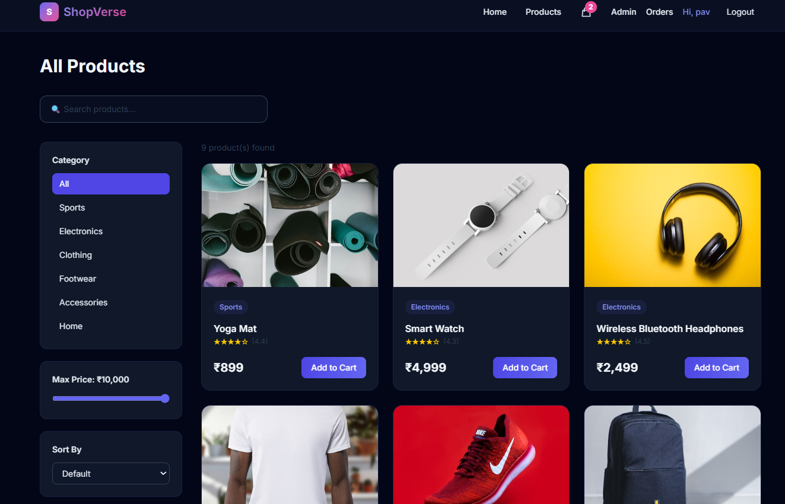
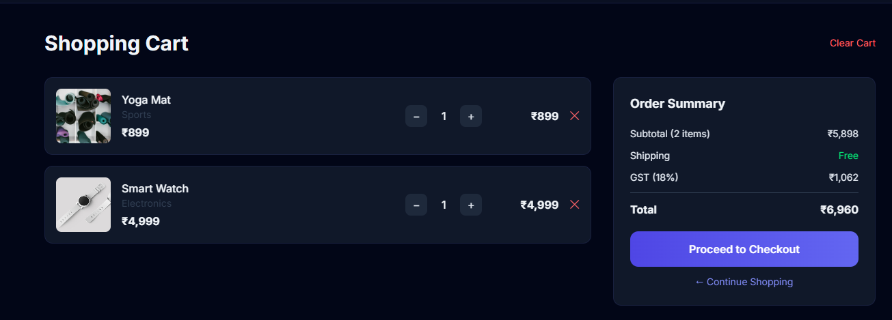
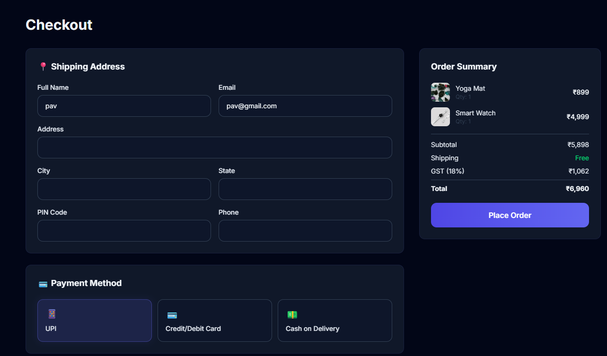
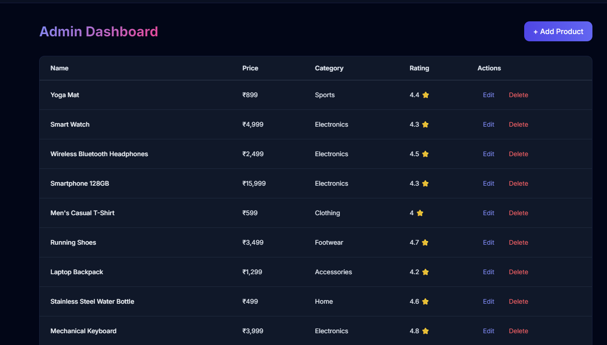

# E-Commerce Platform

A simple full-stack e-commerce project built with Node.js, Express, MongoDB, and React. It features JWT-based authentication, basic product browsing/filtering, a shopping cart, and checkout/order tracking.

## Features
- **User Authentication**: JWT-based login and registration, with basic Admin/Customer role-based access.
- **Catalog**: Browse, search, and filter products.
- **Cart & Checkout**: Add/remove items from a persistent shopping cart and place orders.
- **Admin Dashboard**: Simple view for managing products and order statuses.

## Tech Stack
- **Backend**: Node.js, Express.js, MongoDB, Mongoose
- **Frontend**: React 19, Vite, Tailwind CSS

## Screenshots

### Products


### Cart


### Checkout


### Admin



## Getting Started

### 1. Run the Backend
Go to the backend folder and install the dependencies:
```bash
cd backend
npm install
```
Create your `.env` file from the example:
```bash
cp .env.example .env
```
Make sure to fill in your MongoDB connection URI and JWT secret in `.env`, then start the dev server:
```bash
npm run dev
```

### 2. Run the Frontend
Go to the frontend folder, install the packages, and spin up the development server:
```bash
cd frontend
npm install
npm run dev
```

---

## Directory Structure
- `backend/` - Express API server, routes, controllers, middleware, and database models.
- `frontend/` - React application styled with Tailwind.
